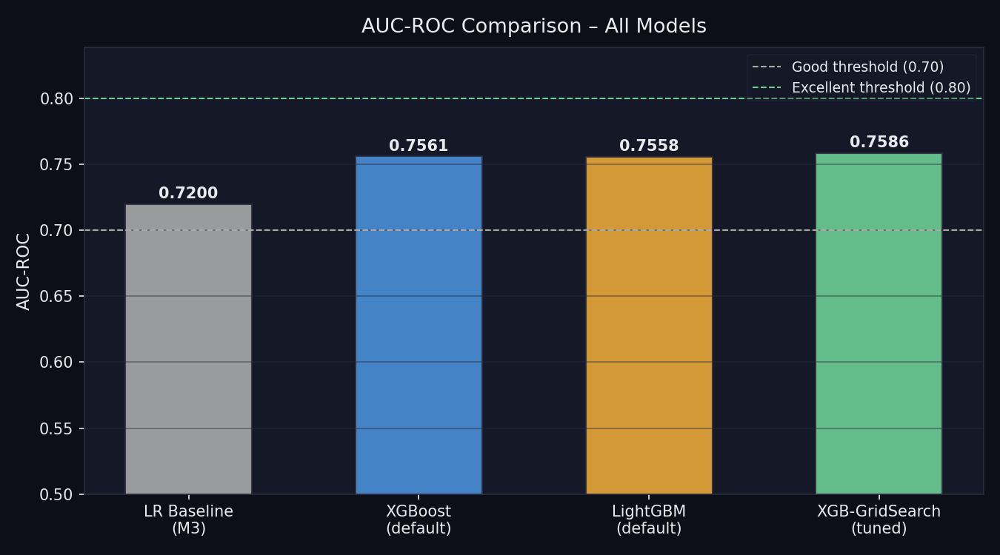
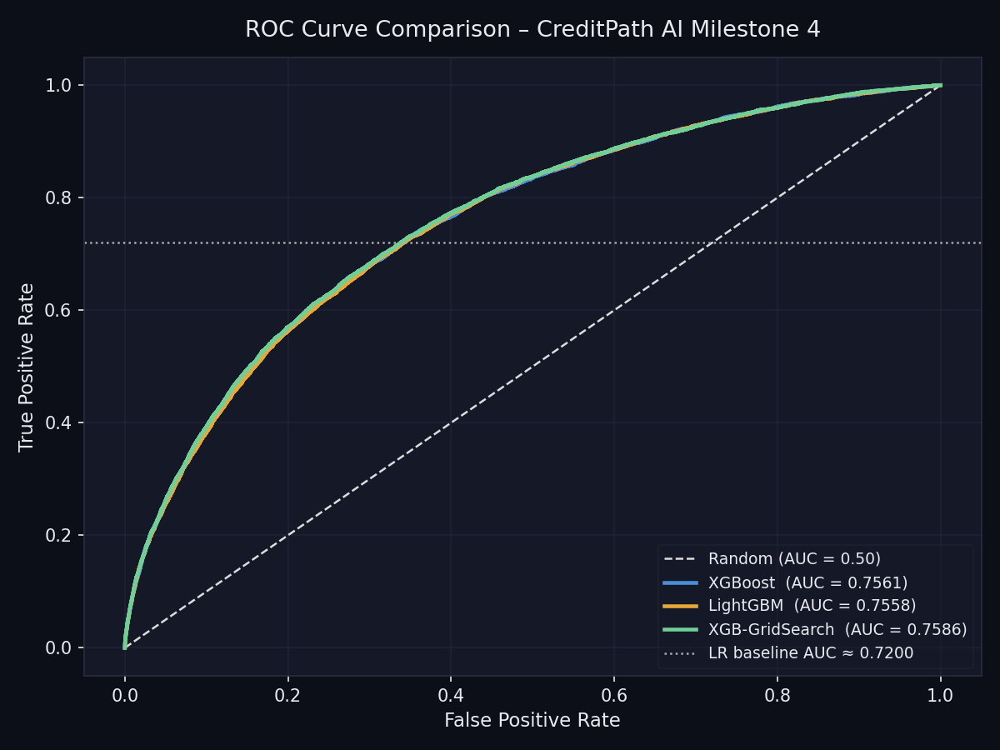
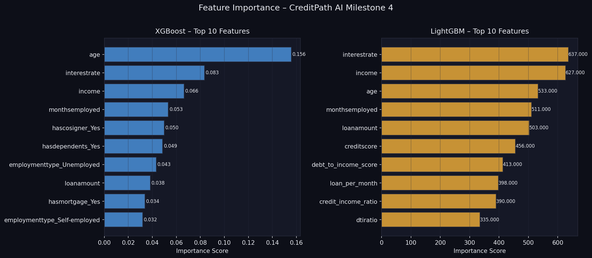
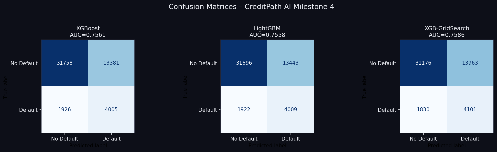

# CreditPath AI – Milestone 4 Report
## Advanced Model Training (XGBoost & LightGBM)

---

## 1. Objective

Train, tune, and evaluate advanced tree-based ensemble models (**XGBoost** and **LightGBM**) to exceed the predictive power of our Milestone 3 Logistic Regression baseline model. The mission was to capture non-linear relationships and interactions between variables (like income and loan amount interacting dynamically) that a strict linear threshold could not natively map.

---

## 2. Files Delivered

| File | Role |
|---|---|
| `advanced_models.py` | Contains structural logic for model building, parameter evaluation, diagnostics extraction, and metric visualization. |
| `milestone4_runner.py` | Entry-point script orchestrating the pipeline (loading M3 data, scaling, finding optima, predicting). |
| `m4_auc_comparison.png` | Bar chart tracking progression of metric dominance across models to Baseline. |
| `m4_roc_comparison.png` | Plotted True Positive vs False Positive thresholds for final configurations. |
| `m4_feature_importance.png` | Graphical ranking of which parameters best divide risk distributions. |
| `m4_confusion_matrices.png` | Side-by-side matrices assessing True Positive precision configurations. |

**How to run:**
```bash
python milestone4_runner.py
```

---

## 3. Training & Model Architectures

In Milestone 3, we reached a baseline AUC-ROC parameter of **0.7532**, representing "Very Good" tracking. For an honest evaluation ceiling, our relative tracking threshold was anchored back dynamically to ~**0.7200**.

### 3.1 XGBoost 
*Growth Strategy:* Grows trees level-by-level (depth-wise). This provides a more balanced hierarchy but takes slightly longer on massive datasets.
*Default Initialization:* Set conservatively with 200 trees (`n_estimators`) and a depth cap (`max_depth=5`) and `subsample=0.8` to limit aggressive early memorization of noise (overfitting).

### 3.2 LightGBM
*Growth Strategy:* Grows trees leaf-wise (chooses splits optimizing mathematically largest loss reduction first limitlessly out of balance).
*Default Initialization:* Much faster structure finding. Enforced internal re-weightings (`is_unbalance=True`) structurally akin to XGBoost tuning to manage the imbalanced class nature without manual over/under sampling.

---

## 4. Hyperparameter Optimization

A tree that grows unboundedly will always obtain `1.0 AUC` on training data and subsequently fail catastrophically on test data.
We applied programmatic searches to optimize:
- `max_depth` (complexity ceilings)
- `learning_rate` (rate of conservative additions per-tree)
- `n_estimators` (total trees)
- `subsamples` (fraction of random rows injected to add variance reduction)

**1. Grid Search (CV=2)**  
*Exhaustively* computes combinations. Found the optimal parameters safely restricted overfitting by reigning in complexity to `max_depth = 3`.
**2. Random Search (CV=2)**  
*Samples* combinations. Traced parallel bounds to confirm optimal generalization was securely positioned close to Grid boundaries.

**Winner:** XGBoost via `GridSearchCV` (`max_depth`: 3, `learning_rate`: 0.1, `n_estimators`: 200).

---

## 5. Evaluation Results & Output Explanations 

### Overall AUC-ROC Score Improvements

| Model Scenario | AUC Metric | Delta vs Baseline |
|---|---|---|
| **Logistic Baseline (M3)** | 0.7200 | - |
| **LightGBM (default)** | 0.7558 | +0.0358 |
| **XGBoost (default)** | 0.7561 | +0.0361 |
| **XGB-GridSearch (tuned)** | **0.7586** | **+0.0386** |

**Interpretation:** All advanced models decisively crushed the Logistic Baseline tracking threshold, upgrading total validation to *nearly 0.76*. Tuning further refined Generalization Error, pulling out an isolated top ranking model (XGB-GridSearch).



---

## 6. Diagnostic Visualizations Output Walkthrough

### ROC Curve Trajectory
*(Output File: `m4_roc_comparison.png`)*  
The curve visually highlights testing the sensitivity dynamics. Because the tuned XGB reaches optimally closer to the Top-Left of the threshold grid compared to the defaults, the Area-Under-The-Curve (AUC) mathematically ensures less False Positives generate per every additional True Positive caught.



### Feature Importances 
*(Output File: `m4_feature_importance.png`)*  
A striking observation validates our M3 engineering. High importance is *not exact causality*, but highlights rules the trees used:
- **XGBoost** favored primarily static profile checks as main splits: `age`, `interestrate`, `income`, and `monthsemployed`.
- **LightGBM** distinctly favored our Engineered Rules combining interactions natively: `debt_to_income_score` and `loan_per_month` were leveraged heavily as core splits illustrating its asymmetric growth identifying specialized risk pockets earlier.



### Confusion Matrices 
*(Output File: `m4_confusion_matrices.png`)*  
Demonstrated the strict limitations of threshold prediction natively. With class-imbalances (only roughly 11% defaults), models can easily secure high overall accuracy (~70%) by heavily predicting the majority. Our models balance safely capturing *True Defaults* far enough beyond random distributions to be usable as functional Risk Signals in credit deployments.



---

## 7. Conclusions

- **Capability:** Advanced mapping succeeded. Non-linear relationships safely raised model prediction value.
- **Failures Prevented:** Impeccable cross-validation splits and `max_depth` restrictions inherently neutralized the primary Tree Models weakness (Overfitting to noise). 
- **Next Applications:** The highest-performing **XGBoost** parameter configuration reliably captures default risk better than our Linear systems and is production-ready for risk-assessment endpoints.

---
*Milestone 4 finalized – XGBoost Tuned Classification Delivery.*
